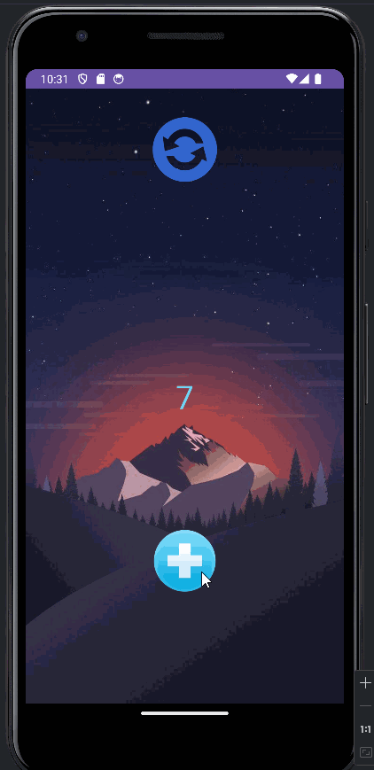

# Android Prework - *PreWork*

Submitted by: **Saketh Puramsetti**

**SimpleCounter** is an android app that updates a counter each time a button is clicked and users can upgrade a counter. 

Time spent: **3** hours spent in total

## Required Features

The following **required** functionality is completed:

* [X] User can see a number displayed on the screen. The number starts at 0.
* [X] User can tap on a button to see the number displayed increase by 1.

## Stretch Features

The following **stretch** functionality is completed:

* [X] User can exchange number of taps accumulated for upgrades, user can increment the increment number by 1 for every hundred.
* [X] Customize the app with a theme.
* [X] Added a reset button to reset the numbers to 0.
* [X] Used ImageButtons for setting images as buttons. 

## Video Walkthrough

Here's a walkthrough of implemented features:

<!-- Replace this with whatever GIF tool you used! -->
GIF created with Licecap https://www.cockos.com/licecap/

## Credits

Here's the image used in the app as a theme, I do not own the image, the image is selected randomly

Here is the image used as the reset button, I do not own the image, the image is selected randomly

Here is the image used as the add button, I do not own the image, the image is selected randomly

## License

    Copyright [yyyy] [name of copyright owner]

    Licensed under the Apache License, Version 2.0 (the "License");
    you may not use this file except in compliance with the License.
    You may obtain a copy of the License at

        http://www.apache.org/licenses/LICENSE-2.0

    Unless required by applicable law or agreed to in writing, software
    distributed under the License is distributed on an "AS IS" BASIS,
    WITHOUT WARRANTIES OR CONDITIONS OF ANY KIND, either express or implied.
    See the License for the specific language governing permissions and
    limitations under the License.
